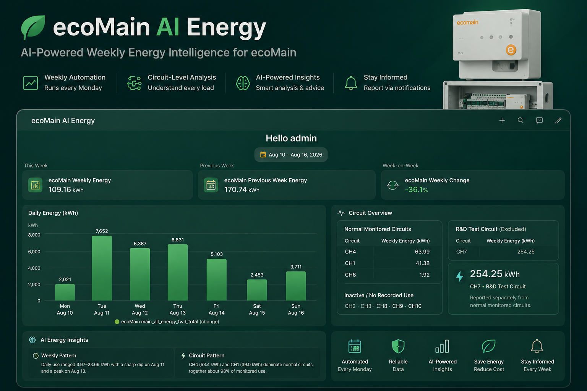
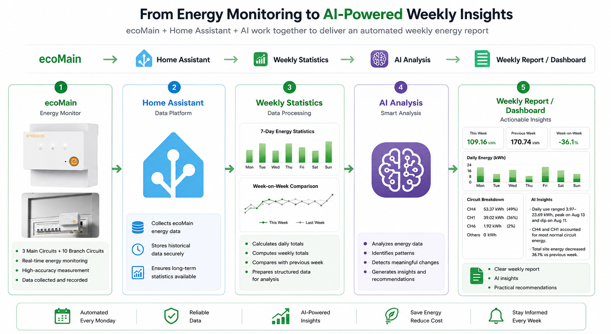

# ⚡ Turn Your Home Energy Data into an AI Weekly Report

### Automated energy insights with ecoMain, Home Assistant and AI

Energy monitoring gives you data.

But understanding what that data means still takes time.

This project turns **ecoMain energy measurements** into an automatically generated **AI Weekly Energy Report** using Home Assistant and a compatible AI conversation agent.

The workflow automatically:

- collects the latest complete week of energy data
- compares it with the previous week
- analyzes monitored circuit consumption
- identifies meaningful energy-use patterns
- generates AI-powered insights and recommendations
- delivers a complete weekly energy report



> **Dashboard shown for demonstration purposes.**
>
> The Blueprint generates the weekly energy analysis and report automatically.
> The dashboard above is an optional visualization layer and is not required to use the Blueprint.

---

# ✨ What It Does

Every Monday, the automation automatically analyzes the previous complete week.

```text
ecoMain
   ↓
Home Assistant Statistics
   ↓
Weekly Energy Analysis
   ↓
AI Conversation Agent
   ↓
Weekly Energy Report
```

The report helps answer questions such as:

- How much energy did I use this week?
- Which day consumed the most energy?
- Which monitored circuits dominated consumption?
- How did this week compare with last week?
- Were there any patterns worth paying attention to?
- What practical actions could be considered next?

---

# 🧠 How It Works

The system combines three layers:

### ⚡ ecoMain — Energy Data Layer

ecoMain provides total and circuit-level energy measurements.

### 🏠 Home Assistant — Automation Layer

Home Assistant:

- stores historical statistics
- selects the reporting period
- calculates weekly values
- compares consecutive weeks
- sends structured data to the AI agent
- generates the final report

### 🤖 AI — Intelligence Layer

The AI interprets the structured statistics and converts them into concise, human-readable energy insights.



The AI does **not** replace energy measurement or statistical processing.

**ecoMain measures → Home Assistant calculates → AI interprets.**

---

# 📦 What You Need

Before importing the Blueprint, you need:

- **ecoMain** energy monitor
- **Home Assistant**
- ecoMain energy entities available in Home Assistant
- Home Assistant Recorder / statistics
- a compatible **Home Assistant Conversation Agent**
- an API key or local model required by your selected AI provider
- **HACS** if your chosen AI integration is installed through HACS

The dashboard shown in this repository is optional.

---

# 🤖 AI Conversation Agent

The Blueprint uses Home Assistant's `conversation.process` action to send the weekly energy statistics to a selected Conversation Agent.

This means the project is **not tied to one specific AI model**.

## DeepSeek used in this demo

The demonstration shown in this repository uses **DeepSeek Conversation** as the AI conversation agent.

If you want to reproduce the same setup, install a compatible DeepSeek Conversation integration through HACS.

### Example installation

1. Install **HACS** if it is not already available.
2. Open **HACS → Integrations**.
3. Install a compatible **DeepSeek Conversation** integration.
4. Restart Home Assistant.
5. Open:

```text
Settings
→ Devices & Services
→ Add Integration
```

6. Add and configure **DeepSeek Conversation**.
7. Enter your DeepSeek API key.
8. Make sure the DeepSeek Conversation Agent is available in Home Assistant.
9. Select it when configuring this Blueprint.

> **Important**
>
> DeepSeek is the AI provider used in this demonstration, but it is not a hard requirement of the Blueprint.
>
> Another compatible Home Assistant Conversation Agent can be selected instead.

---

# 🚀 Import the Blueprint

Import the Blueprint into Home Assistant and create a new automation from it.

[](https://my.home-assistant.io/redirect/blueprint_import/?blueprint_url=https%3A%2F%2Fraw.githubusercontent.com%2Flianyangyang0608-boop%2FTurn-Your-Home-Energy-Data-into-an-AI-Weekly-Report%2Frefs%2Fheads%2Fmain%2Fcode)

The setup interface allows you to select your own ecoMain entities and AI Conversation Agent.


The Blueprint does not require the entity IDs used in this demonstration.

Instead, select the appropriate sensors from **your own ecoMain installation**.

---

# ⚙️ Blueprint Configuration

## 1. Main Energy Statistic

Select the ecoMain statistic representing the total site energy consumption.

For example:

```text
main_all
```

This value is used for:

- weekly total
- daily average
- highest-consumption day
- lowest-consumption day
- week-on-week comparison

---

## 2. Monitored Circuit Statistics

Select the circuit statistics you want included in the weekly circuit analysis.

Only select circuits that you want the AI to analyze as normal monitored loads.

The Blueprint does not assume what appliances are connected to these circuits.

---

## 3. Optional Test / Special Load

Some installations may contain temporary, experimental or otherwise special loads.

These can be excluded from normal circuit analysis.

In the development environment used for this project, one circuit was used as an **R&D test load** and therefore treated separately.

This is specific to the demonstration environment.

Your installation may not require a special-load circuit at all.

---

## 4. AI Conversation Agent

Select the Conversation Agent that should analyze the weekly statistics.

For this demonstration:

```text
DeepSeek Conversation
```

You may select another compatible agent instead.

---

# 📅 Automatic Weekly Reporting

The automation runs every Monday and analyzes the previous complete Monday–Sunday period.

For example:

```text
Monday Aug 17
      ↓
Analyze Aug 10 – Aug 16
      ↓
Compare with Aug 03 – Aug 09
```

The dates are calculated automatically.

No manual reporting-period updates are required.

A simplified version of the date logic is:

```yaml
- variables:
    week_start: >
      {{ today_at("00:00") - timedelta(days=now().weekday() + 7) }}

    week_end: >
      {{ today_at("00:00") - timedelta(days=now().weekday()) }}

    prev_start: >
      {{ today_at("00:00") - timedelta(days=now().weekday() + 14) }}

    prev_end: >
      {{ today_at("00:00") - timedelta(days=now().weekday() + 7) }}
```

---

# 📊 What Gets Analyzed?

Home Assistant retrieves daily statistics from ecoMain using `recorder.get_statistics`.

From those statistics, the workflow calculates:

### Weekly KPIs

```text
This Week
Previous Week
Week-on-Week Change
```

### Daily Energy

The report identifies:

```text
Daily energy consumption
Highest-consumption day
Lowest-consumption day
Daily consumption pattern
```

### Circuit Breakdown

Selected circuits are compared to identify:

```text
Highest-consumption circuits
Circuit energy distribution
Inactive / zero-use circuits
Meaningful week-on-week changes
```

---

# 🧠 AI Energy Insights

After Home Assistant finishes the statistical processing, the structured results are sent to the selected AI Conversation Agent.

The AI is asked to interpret:

### Weekly Pattern

How consumption changed across the week.

### Circuit Pattern

Where monitored energy consumption was concentrated.

### Week-on-Week Pattern

How the latest week differed from the previous week.

The AI is explicitly instructed **not to invent**:

- appliance identities
- operating reasons
- equipment faults
- unsupported anomaly explanations
- unsupported savings estimates

For example:

> **Weekly Pattern**  
> Daily use ranged from 3.97–23.69 kWh, with a clear mid-week peak.

> **Circuit Pattern**  
> Two monitored circuits accounted for most normal monitored energy consumption.

> **Week-on-Week**  
> Total site energy decreased compared with the previous reporting period.

The goal is not to make the AI diagnose the electrical system.

The goal is to make weekly energy data **easier to understand**.

---

# 📄 Complete Weekly Energy Report

In addition to short insights, the automation generates a complete weekly report.


The report contains:

1. **This Week at a Glance**
2. **Daily Energy**
3. **Circuit Breakdown**
4. **Week-on-Week Comparison**
5. **Special / Test Load**, if configured
6. **AI Insights**
7. **Abnormal Use Assessment**
8. **Recommendations**

If the available data does not provide enough evidence to identify abnormal energy use, the AI is instructed to avoid overdiagnosis.

For example:

> **No confirmed abnormal energy use was detected.**

---

# 📈 Optional Dashboard

The Blueprint's primary output is the **AI Weekly Energy Report**.

The dashboard shown at the beginning of this repository is an additional visualization built on top of the generated statistics.

It can be used to display:

```text
Weekly Energy
Previous Week Energy
Week-on-Week Change

Daily Energy Chart

Circuit Overview

AI Weekly Pattern
AI Circuit Pattern
AI Week-on-Week Insight
```

The dashboard is **not required** for the Blueprint to operate.

This keeps the Blueprint easier to reuse across different Home Assistant installations and dashboard layouts.

A reusable dashboard configuration may be added separately in the future.

---

# 🏠 From Energy Monitoring to Energy Understanding

Traditional energy monitoring answers:

> **How much electricity did I use?**

Adding historical comparison and AI interpretation allows the system to also ask:

> **How did my consumption change?**

> **Where was monitored energy concentrated?**

> **What changed compared with last week?**

> **What should I pay attention to next?**

The architecture can be summarized as:

```text
Measure
   ↓
Organize
   ↓
Compare
   ↓
Understand
   ↓
Act
```

With:

```text
ecoMain=Energy Data Layer

Home Assistant=Automation & Integration Layer

AI=Interpretation Layer
```

---

# 🔌 Why the AI Layer Is Replaceable

The energy analysis architecture is intentionally separated from the AI provider.

Home Assistant performs the deterministic work:

```text
Historical data retrieval
Reporting period selection
Weekly calculations
Week-on-week comparison
```

The AI receives the resulting structured information afterward.

Therefore:

```text
ecoMain + Home Assistant
          │
          ▼
   Structured Energy Data
          │
          ▼
 Conversation Agent
```

DeepSeek can be replaced by another compatible Conversation Agent without changing the fundamental energy-monitoring architecture.

---

# 🔮 What's Next?

This example focuses on weekly electricity consumption and circuit-level analysis.

The same architecture could later be extended to include:

- ☀️ Solar generation
- 🔌 Grid import and export
- 🔋 Battery charging and discharging
- 🚗 EV charging
- 💰 Electricity tariffs
- 📅 Monthly energy reports
- 💵 Energy-cost analysis
- 🌱 Carbon-emission estimates

With richer energy data, the same architecture could evolve from weekly reporting toward more context-aware residential energy management.

---

# 🛠️ Build Your Own

To reproduce the project:

1. Connect ecoMain to Home Assistant.
2. Confirm that ecoMain energy statistics are available.
3. Install and configure a compatible AI Conversation Agent.
4. Import the Blueprint.
5. Select your main energy statistic.
6. Select the monitored circuits you want analyzed.
7. Select the AI Conversation Agent.
8. Create the automation.
9. Run it manually once for testing.
10. Enable the weekly schedule.

That's it.

Every week:

```text
ecoMain data
      ↓
Home Assistant
      ↓
AI analysis
      ↓
Weekly Energy Report
```

---

# ⚠️ Notes

This project demonstrates an **ecoMain + Home Assistant + AI** energy-analysis workflow.

AI-generated insights depend on the quality and availability of the underlying measurement data.

They should not be treated as confirmed:

- electrical faults
- equipment diagnostics
- appliance identification
- professional energy audits

The demonstration data in this repository comes from a development and testing environment.

Your circuit configuration and energy-use patterns will be different.

---

# 🙏 Acknowledgements

This project uses:

- **ecoMain** for energy monitoring
- **Home Assistant** for statistics, automation and visualization
- a compatible **AI Conversation Agent** for energy-data interpretation

The demonstration configuration uses **DeepSeek Conversation** as its AI agent.

---

# About enecess

**ecoMain** is part of the enecess smart energy management ecosystem.

Visit the official enecess website for more information about ecoMain and related energy-management products.

---

### ⚡ ecoMain × Home Assistant × AI

**Turn energy data into something you can understand and act on.**
