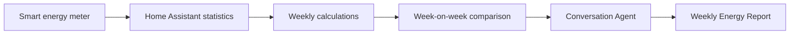
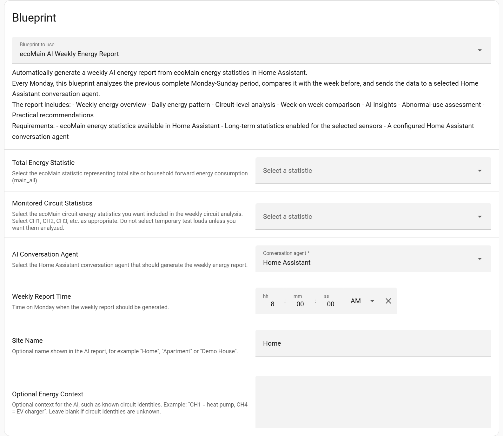
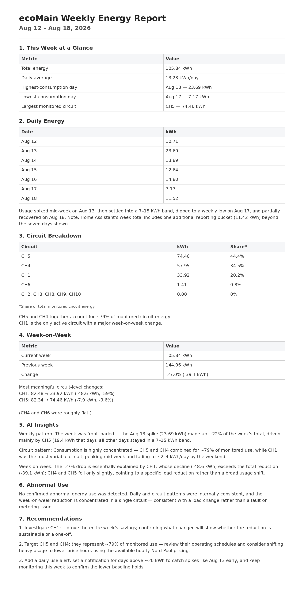

# ⚡ AI Weekly Energy Report for Home Assistant

Turn the energy statistics already stored in Home Assistant into an automatic weekly report with comparisons, circuit summaries, and AI-assisted explanations.

I built this Blueprint because I wanted a quicker way to review weekly energy use without opening several charts and comparing every circuit manually.


| At a glance ||
|---|---|
| **Schedule** | Runs on Monday at the time you choose |
| **Reporting period** | Previous complete Monday–Sunday week |
| **Comparison** | Latest week vs. the week before |
| **Inputs** | Total energy statistic, selected circuits, Conversation Agent |
| **Output** | A persistent Home Assistant notification containing the weekly report |
| **Meter used in my setup** | enecess ecoMain |
| **Other meters** | Possible if they expose suitable cumulative energy statistics to Home Assistant |

---

## ✨ What It Does

Every week, the Blueprint:

- reads the previous complete week of energy statistics
- compares it with the preceding week
- calculates weekly and daily energy values
- compares the monitored circuits you selected
- sends the processed results to a Home Assistant Conversation Agent
- creates a structured weekly energy report



The AI is used only for interpretation.

**The meter measures, Home Assistant calculates, and the Conversation Agent explains.**

---

# 🚀 Quick Start

## 1. Check the Requirements

You need:

- **Home Assistant**
- a smart energy meter integrated with Home Assistant
- cumulative energy statistics available in Home Assistant
- at least one total-energy statistic
- optional circuit or sub-meter statistics
- a configured Home Assistant **Conversation Agent**
- enough history for the reporting period you want to compare

For a useful week-on-week comparison, allow Home Assistant to collect at least **two complete weeks** of energy statistics.

---

## 2. Import the Blueprint

[](https://my.home-assistant.io/redirect/blueprint_import/?blueprint_url=https%3A%2F%2Fraw.githubusercontent.com%2Flianyangyang0608-boop%2FTurn-Your-Home-Energy-Data-into-an-AI-Weekly-Report%2Frefs%2Fheads%2Fmain%2Fcode)

Then open:

```text
Settings
→ Automations & Scenes
→ Blueprints
→ Create Automation
```

Select the imported Blueprint.

---

## 3. Configure the Blueprint

<p align="center">
  
</p>

You mainly need to configure:

| Setting | What to select |
|---|---|
| **Total Energy Statistic** | Your whole-home or site-level cumulative energy statistic |
| **Monitored Circuit Statistics** | The circuits or sub-meters you want included in the weekly comparison |
| **AI Conversation Agent** | The Home Assistant Conversation Agent that will write the report |
| **Weekly Report Time** | The time on Monday when the report should run |
| **Site Name** | Optional name displayed in the report |
| **Optional Energy Context** | Optional descriptions for known circuits |

> [!IMPORTANT]
> Do not copy the entity or statistic IDs from my setup. Select the statistics from your own Home Assistant installation.

---

## 4. Run It Once Manually

Before waiting for the scheduled Monday run:

1. Save the automation.
2. Run the automation manually once.
3. Check Home Assistant notifications for the generated report.
4. Confirm that the weekly total and daily values look reasonable.
5. Confirm that the selected circuits appear in the report.
6. Check that the AI does not invent appliance identities.

If the report is generated correctly, leave the automation enabled for the weekly schedule.

---

# 📦 Smart Meter Requirements

The Blueprint does not communicate directly with the physical meter. It reads statistics already available in Home Assistant.

## Required

At least one cumulative energy statistic representing total consumption.

Typical unit:

```text
kWh
```

## Optional

Additional cumulative energy statistics for:

- individual circuits
- sub-meters
- rooms or zones
- major monitored loads

In my test environment, I used an **enecess ecoMain**. The Blueprint inputs themselves are Home Assistant statistics, so another meter may also work if it exposes equivalent cumulative energy data.

Possible examples include smart meters connected through Shelly, IoTaWatt, Modbus, or other Home Assistant integrations. These are examples rather than a tested compatibility list.

> [!TIP]
> Check **Developer Tools → Statistics** and confirm that the required energy statistics exist before configuring the Blueprint.

If your device provides only instantaneous power in watts, you may need to create a cumulative energy entity before using this Blueprint.

<details>
<summary><strong>Using a meter other than ecoMain</strong></summary>

The current Blueprint was built and tested with ecoMain statistics, and some labels in the YAML still use the ecoMain name.

Functionally, the main inputs are Home Assistant statistics:

- one total-energy statistic
- zero or more monitored-circuit statistics

To adapt it to another meter:

1. Confirm that the meter exposes cumulative energy statistics.
2. Select those statistics in the Blueprint UI.
3. Add known circuit names in **Optional Energy Context**, if useful.
4. Optionally rename the Blueprint description, AI prompt, and notification title in the YAML to remove the remaining ecoMain wording.

</details>

---

# 🤖 Conversation Agent Setup

The Blueprint uses Home Assistant's `conversation.process` action.

It is not tied to one specific AI provider.

## My Test Setup

I used **DeepSeek Conversation** during development.

A basic setup is:

1. Install a compatible DeepSeek Conversation integration through HACS.
2. Restart Home Assistant if the integration requires it.
3. Add and configure the integration.
4. Enter the required API key.
5. Confirm that the Conversation Agent appears in Home Assistant.
6. Select it in the Blueprint configuration.

Another compatible Home Assistant Conversation Agent can be used instead.

<details>
<summary><strong>Example DeepSeek installation path</strong></summary>

```text
HACS
→ Integrations
→ Install a compatible DeepSeek Conversation integration
```

Then:

```text
Settings
→ Devices & Services
→ Add Integration
```

Configure the integration and verify that its Conversation Agent is selectable in the Blueprint.

</details>

---

# 🧠 Blueprint Configuration Details

## Total Energy Statistic

Select the statistic representing total energy consumption for the monitored household or site.

It is used to calculate:

- latest-week total
- previous-week total
- daily average
- highest-consumption day
- lowest-consumption day
- week-on-week percentage change

---

## Monitored Circuit Statistics

Select only the circuits that are useful for your weekly review.

The Blueprint compares them to identify:

- highest-consumption monitored circuits
- circuit energy distribution
- inactive or zero-use circuits
- meaningful changes from the previous week

The circuits do not need to add up exactly to the whole-home total.

---

## Optional Energy Context

The Blueprint should not guess which appliance is connected to an unnamed circuit.

If you know the circuit identities, add simple context such as:

```text
CH1 = Heat Pump
CH4 = EV Charger
CH5 = Kitchen
```

If the field is left blank, the AI should describe the circuits only by their available names.

---

## Weekly Report Time

The Blueprint runs only on Monday and analyzes the previous complete Monday–Sunday period.

For example:

```text
Monday Aug 17
      ↓
Analyze Aug 10 – Aug 16
      ↓
Compare with Aug 03 – Aug 09
```

The date ranges are calculated automatically.

---

# 📊 What Gets Analyzed

## Weekly Overview

The deterministic calculations include:

| Metric | Description |
|---|---|
| **This Week** | Total energy for the latest complete week |
| **Previous Week** | Total energy for the week before |
| **Week-on-Week Change** | Percentage change between the two weeks |
| **Daily Average** | Average daily energy during the latest week |
| **Highest Day** | Day with the greatest consumption |
| **Lowest Day** | Day with the lowest consumption |

## Daily Energy

The report shows all seven daily values and summarizes the weekly pattern.

## Circuit Breakdown

Selected circuits are ranked by weekly energy use and compared with their previous-week values.

## AI Interpretation

After Home Assistant completes the calculations, the Conversation Agent explains:

- how consumption changed during the week
- where monitored energy was concentrated
- what changed compared with the previous week
- what may be worth checking next

---

# 📄 Example Report Structure

The generated report contains:

1. **This Week at a Glance**
2. **Daily Energy**
3. **Circuit Breakdown**
4. **Week-on-Week Comparison**
5. **AI Insights**
6. **Abnormal Use Assessment**
7. **Recommendations**

The exact wording depends on the selected statistics, optional context, and Conversation Agent.

### Example AI-Generated Report

After Home Assistant calculates the weekly statistics, the selected Conversation Agent turns the structured data into the final report shown in a persistent notification.

<p align="center">
  
</p>

<p align="center">
  <em>Example report generated in my test environment. Your values, circuit names, and wording will depend on your own setup.</em>
</p>

---

# 🔌 AI Guardrails

The prompt tells the Conversation Agent not to invent:

- appliance identities
- reasons for consumption changes
- equipment faults
- unsupported anomaly explanations
- unsupported savings estimates

A high-consumption circuit is not automatically faulty, and a large week-on-week change does not automatically indicate an electrical problem.

If there is not enough evidence, the report is instructed to state:

> **No confirmed abnormal energy use was detected.**

The goal is to make the measured data easier to review, not to turn the AI into an electrical diagnostic system.

---

# 📈 Optional Dashboard

The Blueprint's core output is the weekly report shown as a Home Assistant persistent notification.

A dashboard is optional.

During testing, I also used a dashboard to display:

- latest-week energy
- previous-week energy
- week-on-week change
- daily energy chart
- circuit overview
- short AI insights

The Blueprint does not include or require a specific dashboard layout, so you can build one using the cards and design you prefer.

---

# 📅 Troubleshooting

| Problem | What to check |
|---|---|
| **No report appears** | Confirm the automation ran, the Conversation Agent is available, and Home Assistant created a persistent notification |
| **Weekly total is 0** | Check that the selected total-energy statistic contains valid `change` data for the reporting period |
| **Circuit data is missing** | Confirm the correct circuit statistics were selected |
| **No useful week-on-week comparison** | Make sure at least two complete weeks of history are available |
| **AI invents appliance names** | Remove ambiguous context and confirm the prompt/agent follows the supplied rules |
| **Agent call fails** | Check the AI integration, API key, provider quota, and Conversation Agent configuration |
| **Different units or unexpected values** | Inspect the selected statistics in Developer Tools and confirm they represent cumulative energy |

---

# 🙏 Limitations

- This is a hobby / experimental Home Assistant project.
- The report depends on the quality and completeness of the source statistics.
- The AI output is interpretive and may vary between providers and models.
- Circuit names are not the same as automatic appliance identification.
- The report is not a professional energy audit or electrical fault diagnosis.
- The current version creates a persistent notification; it does not automatically export a PDF or send an email.
- The current code was tested with ecoMain statistics and DeepSeek Conversation, although the general workflow can be adapted.

---

# 🔮 Ideas for Extending It

Possible future additions:

- solar generation
- grid import and export
- battery charging and discharging
- EV charging
- electricity prices
- monthly reporting
- energy-cost analysis
- carbon-emission estimates
- export to email, Markdown, or PDF

I kept these outside the current version so the weekly electricity report remains relatively simple.

---

# ⚠️ Notes

This project was built from my own Home Assistant setup.

I happened to use an **enecess ecoMain** as the smart meter and **DeepSeek Conversation** as the AI agent, but the main idea is broader:

> Use the energy statistics Home Assistant already has, organize them once a week, and let a Conversation Agent help explain the result.

Your meter, statistics, circuits, AI provider, and dashboard will probably be different from mine.

That is expected. Feel free to adapt the Blueprint to your own setup.
